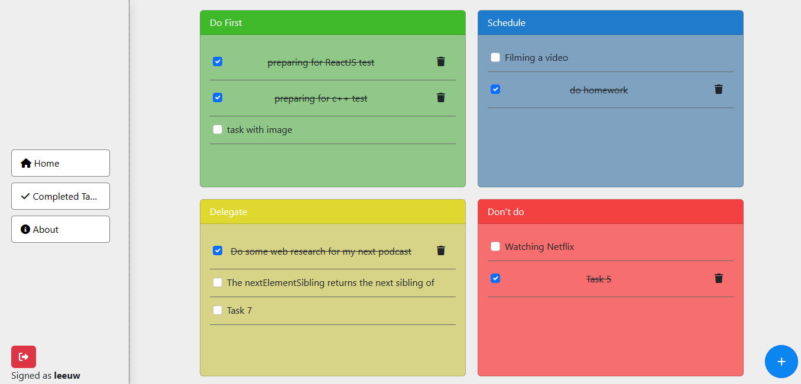
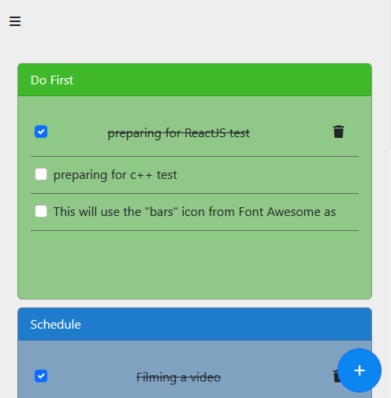

# App Preview



# Distinctiveness and Complexity

**The Eisenhower app** aims to help users manage their tasks effectively by providing a simple and intuitive interface for organizing and prioritizing tasks based on the Eisenhower matrix. The Eisenhower matrix is a productivity tool that categorizes tasks into four quadrants based on their urgency and importance. This approach allows users to focus on the most important and urgent tasks first, while also ensuring that less urgent but still important tasks do not get overlooked.

The app's distinctiveness comes from its use of the Eisenhower matrix, which is a proven and well-established productivity tool, but not commonly used in task management apps. This approach allows the app to stand out from other task management apps.

The complexity of the app comes from the implementation of the Eisenhower matrix, which requires a significant amount of work to ensure that tasks are correctly categorized and displayed to the user. The app provide users the ability to visit a single task in its own page to see more details about the task and edit or delete it. There is also another section called **completed tasks** that displays all the tasks that have been completed.

Overall, the Eisenhower app satisfies the distinctiveness and complexity requirements by offering a unique approach to task management that is based on a proven productivity tool, and by providing a complex and challenging implementation that results in a user-friendly and effective task management app.


# The structure and the role of each file
`admin.py` : This file in Django is used to define the admin interface for your Django application. The admin interface is a web-based interface that allows you to manage the data in your database through a web browser.
In our app we define two models (Tasks and Users) to be managed from the admin interface.

`models.py` : This file is where we define our database models. A model is a Python class that defines the fields and behavior of the data you want to store in the database. Each attribute of the class represents a field in the database table. 
In our app we created two models : `Tasks` and `Users`.

`view.py` : This file is where we define the logic for handling requests and generating responses for a specific URL. A view is a Python function or class-based view that takes a web request and returns a web response. The response can be the HTML contents of a webpage, or a redirect, or a 404 error, or an XML document, or anything.

- `index` : This function that returns the *index.html* html file in the default url `/`
- `task` : This function returns the desired task, it takes a task_id and returns its details.
- `completedTask` : This function returns all the completed tasks or those that have their status equal to `done`.
- `CreateTask` : This function create a new task and return a json object to the frontend including all the details about the created tasks.
- `EditTask` : This function update a task and return a json object to the frontend including all the new details about the updated tasks.
- `UpdateTaskStatus` : This function update the task's status and return a json object to the frontend including the new status for the tasks.
- `DeleteTask` : This function delete a task.
- `DeleteTaskWithoutAjax`: This function also delete a task but without using ajax. Almost all the functions implemented including (CreateTask, EditTask, UpdateTaskStatus and DeleteTask) use ajax except for this one.
- `login_view` : This function for login purposes. 
- `logout_view` : This function for logout purposes.
- `register` : This function create new account.

`url.py` : This file is where we define the URL patterns for the application. A URL pattern is a combination of a URL and a view function that should be called when that URL is requested.
The following are URLs used in the application:
- `/` : default url. 
- `task/task_id` : This is used for viewing more details about each task.
- `completed_Tasks` : This is used for displaying all completed tasks.
- `create_task` : This is used to create a new task.
- `edit_task/task_id` : This is used to edit a task.
- `update_task_status/task_id` : This is used to update the status of a task (done or in_progress).
- `delete_task/task_id` : This is used to delete a task.
- `delete_task_wajx/task_id` : This is used to delete a task without ajax.
- `register` : creating new account.
- `login`  : for loggin in to the app.
- `logout` : for loggin out from the app.

### templates
- `layout.html` : This file is a base template that defines the overall structure and layout of a website. It contains the common elements that are shared across all pages, such as the header, footer, navigation menu, and any other elements that are present on every page.

- `index.html` : Default page to be displayed.
- `task_info.html` : Show more details about a task.
- `completedTask.html` : Displaying all completed tasks.
- `login.html` : This is for login purposes.
- `register.html` : This is for registration purposes.
- `404.html` : This is used for displying 404 error in case there is one.

### static
- css
    - `style.css` : general css styles for the app.
    - `toast.css` : css for toast used.
    - `bootstrap.min.css` : boostrap css.
- js
    - `toast.js` : js for toast used.
    - `bootstrap.bundle.min` : boostrap js.
    - `helper.js` : containing some js code for mobile-responsive purposes.

- img 
    - `screenshot_for_app.png` : a screenshot of the app used in this file.

`eisenhowermatrix_db.sql` : is an SQL file containing SQL statements for creating a database for this application.

`README.md` : This file. 

# How to run the app

1. Install all the packages needed
```bash
pip install -r requirements.txt
```

2. Creating the database.

My app uses Mysql database, so I used the xampp to connect to MySql. You need to use xampp or any other tool that will do the work.
- Create a database called `EisenHowerMatrix_db`
- Then, import this file `eisenhowermatrix_db.sql` to populate the database.

3. Make migrations
```bash
python manage.py makemigrations
```
4. Migrate
```bash
python manage.py migrate
```

2. Run the app
```bash
python manage.py runserver
```

# Additional info
What can EisenHower App Do:
- User have the ability to create new task, user can specify the type of task: (`Do first`, `Schedule`, `Delegate` or `Don't do`).
- User have the ability to mark a task as done or revert its satus as `in_progress`.
- User have the ability to delete.
- User have the ability to see all the previous tasks that have been completed and delete them.
- Every task have its page, so user can see more detail about it. you can visit it by clicking on the task title.
- User update a task from its page mentioned above.
- The maxLenght of task's title is 100 characters.
- The app is mobile-responsive.